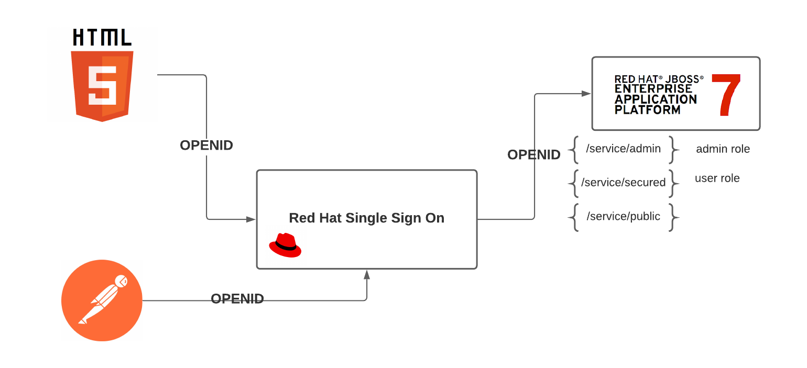

### This repository is a fork from - https://github.com/keycloak/keycloak-quickstarts;

We did some changes to make it easier to run **service-jee-jaxrs** and **app-jee-html5** applications on **Openshift** without needing to spend much time configuring Keycloak adapter on Wildfly / JBoss application server;

**YOU CAN USE THIS REPOSITORY TO DEPLOY KEYCLOAK APPLICATIONS ON OPENSHIFT IN ORDER TO MAKE SOME DEMONSTRATIONS AND SEE HOW THE PRODUCT CAN PROTECT YOU APPLICATIONS**

# <span>Keycloak</span> Quickstarts

<span>Keycloak</span> is an Open Source Identity and Access Management solution for modern Applications and Services.

The quickstarts demonstrate securing TWO applications with <span>Keycloak</span>. 

Below you can see the topology of this project and check how we protect those applications using keycloak;



## Requirements

- An instance of Openshift running;
- An instance of Red Hat Single Sign-On or Keycloack running

## Summary

0. [Configuring keycloack client for the service-jee-jaxrs application (Red Hat Single Sign-On)](#testdrive-step-0)
1. [Generating the service-jee-jaxrs packge application](#testdrive-step-1)
2. [Configuring keycloack client for the app-jee-html5 application (Red Hat Single Sign-On)](#testdrive-step-0)
3. [Generating the app-jee-html5 package application](#testdrive-step-2)
4. [Deploying the service-jee-jaxrs and app-jee-html5 applications on Openshift](#testdrive-step-3)


### Configuring keycloack client for the service-jee-jaxrs application <a name="testdrive-step-0"></a>

Prior to running the quickstart you need to create a client in Keycloak and download the installation file.

The following steps shows how to create the client required for this quickstart:

1. Open the Keycloak admin console
2. Select Clients from the menu
3. Click Create
4. Add the following values:
5. Client ID: You choose (for example service-jaxrs)
6. Client Protocol: openid-connect
7. Click Save

Once saved you need to change the **Access Type** to **bearer-only** and click save.

Finally you need to configure the adapter, this is done by retrieving the adapter configuration file:

1. Click on Installation in the tab for the client you created
2. Select Keycloak OIDC JSON
3. Click Download
4. Move the file **keycloak.json** to the **service-jee-jaxrs/config/** directory in the root of the quickstart

**You may also want to enable CORS for the service if you want to allow invocations from HTML5 applications deployed to a different host. To do this edit keycloak.json and add:**

```bash

{
   ...
   "enable-cors": true
}

```

### Generating the service-jee-jaxrs package application <a name="testdrive-step-1"></a>

The **service-jee-jaxrs** application runs on top of Red Hat JBoss EAP Server 7.0 or Wilfdly 10. The service-jee-jaxrs application requires a keycloak adapter installed into the JBoss or Widlfly Server as described here: https://github.com/keycloak/keycloak-quickstarts/blob/latest/docs/getting-started.md#wildfly, otherwise we can get the error below during the deployment proccess:

```bash
Caused by: java.lang.RuntimeException: UT010039: Unknown authentication mechanism KEYCLOAK
```   

Inside the **sso-eap7-bin-demo/configuration/** directory we have the **standalone-openshift.xml** file that is basically a standalone.xml Wildfly / JBOss configuration file with the keycloak adapter module (I've added the module into my JBoss Application Server running locally and copied the file).

The **sso-eap7-bin-demo/modules/** directory has the modules that will be loaded by our JBoss / Wildfly Application Server running on Openshift later.

Now let's generate the package of our **service-jee-jaxrs** JAVA application.

Go to the **service-jee-jaxrs** directory and run the following maven command:

```bash
mvn clean package -DskipTests
```   
You'll need to get the **BUILD SUCCESS** message as follows:

```bash
[INFO] Tests are skipped.
[INFO] 
[INFO] --- maven-war-plugin:2.6:war (default-war) @ keycloak-service-jee-jaxrs ---
[INFO] Packaging webapp
[INFO] Assembling webapp [keycloak-service-jee-jaxrs] in [/home/raraujo/rh-sso-quickstart/keycloak-quickstarts/service-jee-jaxrs/target/service]
[INFO] Processing war project
[INFO] Copying webapp webResources [/home/raraujo/rh-sso-quickstart/keycloak-quickstarts/service-jee-jaxrs/config] to [/home/raraujo/rh-sso-quickstart/keycloak-quickstarts/service-jee-jaxrs/target/service]
[INFO] Copying webapp resources [/home/raraujo/rh-sso-quickstart/keycloak-quickstarts/service-jee-jaxrs/src/main/webapp]
[INFO] Webapp assembled in [165 msecs]
[INFO] Building war: /home/raraujo/rh-sso-quickstart/keycloak-quickstarts/service-jee-jaxrs/target/service.war
[INFO] ------------------------------------------------------------------------
[INFO] BUILD SUCCESS
[INFO] ------------------------------------------------------------------------
[INFO] Total time: 13.041 s
[INFO] Finished at: 2021-04-23T12:25:53-03:00
[INFO] ------------------------------------------------------------------------

```  
The maven command above will generate the **service.war** package inside the **target** directory.


### Configuring keycloack client for the app-jee-html5 application (Red Hat Single Sign-On)<a name="testdrive-step-2"></a>

Prior to running the quickstart you need to create a client in Keycloak and download the installation file.

The following steps show how to create the client required for this quickstart:

1. Open the Keycloak admin console
2. Select Clients from the menu
3. Click Create
4. Add the following values:
5. Client ID: You choose (for example app-html5)
6. Client Protocol: openid-connect
Root URL: URL to the application (for example http://localhost:8080/app-html5) - **Later You'll need to change that URL pointing to the Openshift route of the app-jee-html5 application.**

7. Click Save

If you deploy the application somewhere else change the hostname and port of the URLs accordingly.

Once saved you need to change the Access Type to public and click save.

Finally you need to configure the javascript adapter, this is done by retrieving the adapter configuration file:

1. Click on Installation in the tab for the client you created
2. Select Keycloak OIDC JSON
3. Click Download
4. Move the file keycloak.json to the **app-jee-html5/config/** directory in the root of the quickstart

### Generating the app-jee-html5 package application <a name="testdrive-step-3"></a>

Let's generate the package of our **app-jee-html5** application.

Go to the **app-jee-html5** directory and run the following maven command:

```bash
mvn clean package -DskipTests
```   
You'll need to get the **BUILD SUCCESS** message as follows:

```bash
[INFO] Tests are skipped.
[INFO] 
[INFO] --- maven-war-plugin:2.6:war (default-war) @ keycloak-app-jee-html5 ---
[INFO] Packaging webapp
[INFO] Assembling webapp [keycloak-app-jee-html5] in [/home/raraujo/rh-sso-quickstart/keycloak-quickstarts/app-jee-html5/target/app-html5]
[INFO] Processing war project
[INFO] Copying webapp webResources [/home/raraujo/rh-sso-quickstart/keycloak-quickstarts/app-jee-html5/config] to [/home/raraujo/rh-sso-quickstart/keycloak-quickstarts/app-jee-html5/target/app-html5]
[INFO] Copying webapp resources [/home/raraujo/rh-sso-quickstart/keycloak-quickstarts/app-jee-html5/src/main/webapp]
[INFO] Webapp assembled in [26 msecs]
[INFO] Building war: /home/raraujo/rh-sso-quickstart/keycloak-quickstarts/app-jee-html5/target/app-html5.war
[INFO] ------------------------------------------------------------------------
[INFO] BUILD SUCCESS
[INFO] ------------------------------------------------------------------------
[INFO] Total time: 8.091 s
[INFO] Finished at: 2021-04-23T12:46:57-03:00
[INFO] ------------------------------------------------------------------------
```  
The maven command above will generate the **app-html5.war** package inside the **target** directory.

### Deploying the service-jee-jaxrs and app-jee-html5 appplications on Openshift <a name="testdrive-step-4"></a>

**Requirements:** We will assume that you already has logged in on your Openchift cluster and has already created a project to deploy the applications;

1. Copy the service.war and the app-html5.war file into the sso-eap7-bin-demo/deployments/ directory:


```bash
$ cp -R service-jee-jaxrs/target/service.war sso-eap7-bin-demo/deployments/

$ cp -R app-jee-html5/target/app-html5.war sso-eap7-bin-demo/deployments/
```

2. Import the JBoss EAP 7.0 Openshift image:

```bash
oc import-image jboss-eap-7/eap70-openshift --from=registry.access.redhat.com/jboss-eap-7/eap70-openshift --confirm
``` 

3. Create a new build config on Openshift pointing to the Fuse Image

```bash
oc new-build --binary=true --image-stream=eap70-openshift --name=rh-sso-applications
``` 

4. Start the build pointing the '--from-dir' variable to the **sso-eap7-bin-demo/** directory

```bash
oc start-build rh-sso-applications --from-dir=./sso-eap7-bin-demo/ --follow
``` 
**During the build process the directory "sso-eap7-bin-demo" will be uploaded into the EAP 7.0 image, replacing the modules and standalone.xml default configuration as well as deploying the service-jee-jaxrs and app-jee-html5 applications into the JBoss 7.0 instance.**

5. Create a new app:

```bash
oc new-app rh-sso-applications
``` 

**The source to image (S2I) process will create all the objects to run the applications**

6. Expose the application

```bash
$ oc get services
NAME                  TYPE        CLUSTER-IP     EXTERNAL-IP   PORT(S)                      AGE
rh-sso-applications   ClusterIP   172.30.65.50   <none>        8080/TCP,8443/TCP,8778/TCP   2m59s
``` 

```bash
$ oc expose service rh-sso-applications
route.route.openshift.io/rh-sso-applications exposed
``` 

```bash
$ oc get routes
NAME                  HOST/PORT                                                                              PATH      SERVICES              PORT       TERMINATION   WILDCARD
rh-sso-applications   rh-sso-applications-rh-sso-applications.apps.cluster-150d.150d.sandbox47.opentlc.com             rh-sso-applications   8080-tcp                 None
``` 
